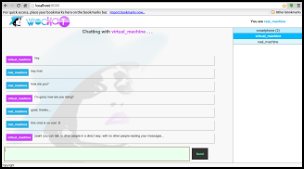

WoChat
======

A *WebSocket*-based chat for **Wisdom of Crowds** experiments, which are usually deployed in LANs. The server-side has been developed in Java using Netty, while the client-side has been written in Javascript using JQuery.

Users are not required to register to log into WoChat; indeed, the WoChat software is designed to be totally anonymous and its users management system is based on IP addressing. Each user has to have a distinct IP and their sessions remain active until: a) they force disconnection, or b) admin disconnect them, or c) their connection go down. Therefore, if a user close the WoChat tab or the browser, his session remains operating and resumes as soon as he comes back.

Download
--------

You can easily clone the full project by executing:

    $ git clone https://github.com/francesco-ficarola/wochat.git

Building and Running
--------------------

After cloning the git repository you can build and run the software by executing:

    $ cd wochat/
    $ ./build.sh
    $ ./run.sh

or, if you prefer all at once, just call the following script:

    $ ./build-and-run.sh
   
The *run.sh* script is there for your convenience. Otherwise, after building, you can find the distribution package (i.e., **WoChat.tar.gz**) inside the *target* folder. You can extract it wherever you like, then run the software by executing:

    $ cd WoChat/
    $ ./startup.sh

If the server properly starts, then open your browser (*Chrome or Firefox are recommended*) and go to:

    http://127.0.0.1:8080/

Configuration
-------------

You can find all parameters that can be changed in **conf/wochat.properties**:

* ```server.port``` : the WoChat's service port
* ```admin.username``` : admin's username
* ```checkingtimes.pendingmessages``` : number of times of checking pending messages before disconnecting a user (set to 0 if you want to disable the acknowledgment mechanism)
* ```communication.timeout``` : time interval of checking pending messages (it works if ```checkingtimes.pendingmessages``` is greater than 0)
* ```killme.now``` : allows users to kill and disconnect themselves.

Admin commands
--------------

If you log into WoChat as Administrator, you can execute the following commands:

```/msg <your_message>``` : sends everyone admin's message

```/disconnect <id_user>``` : forces a user's disconnection

```/start survey1``` : starts the survey mode (round 1)

```/start survey2``` : starts the survey mode (round 2)

```/start chat``` : starts the chat mode

```/kill wochat``` : kills WoChat

User commands
-------------

Below all commands available for users:

```/killme now``` : auto-kill and disconnection (iff ```killme.now=true``` in **wochat.properties**)

Survey
------

All questions must be written in **conf/woc.survey**, one for each line.

Log-files
---------

All log-files are saved in the "logs" folder (from the repository root: target/WoChat/logs).

* *wochat.log* : system log
* *connections.log* : information about users' connections
* *interactions.log* : users' interactions (format parsable by [OpenBeaconParser](https://github.com/francesco-ficarola/OpenBeaconParser))
* *messages.csv* : users' messages in CSV format
* *userslist.csv* : list of all participants in CSV format
* *survey1.csv* : answers for the first survey in CSV format
* *survey2.csv* : answers for the second survey in CSV format

Screenshots
-----------

Click to enlarge.

[](img/screenshot.png)